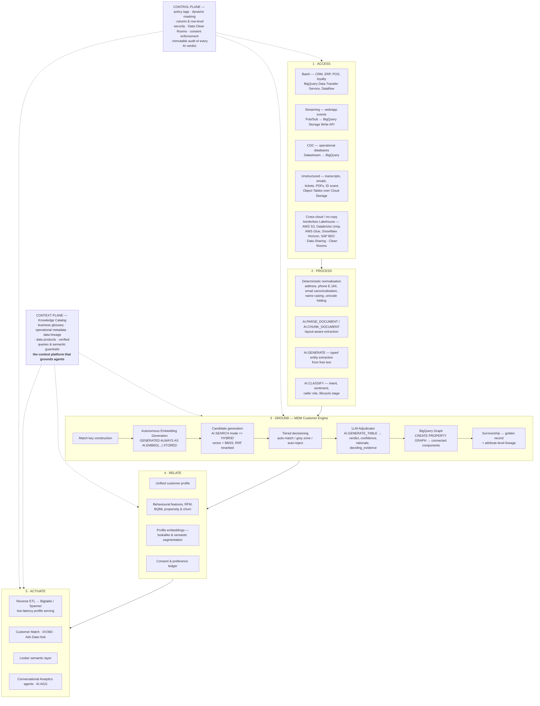
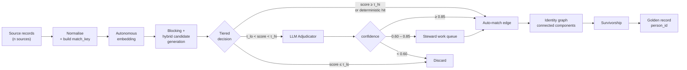

# Composable CDP on Google Cloud — Architecture Specification

**Version:** 0.1 · **Status:** Reference design · **Owner:** mattturner

The keystone of this design is **Master Data Management (Customer)** implemented natively in BigQuery. Layers 1, 2, 4 and 5 are conventional; **Layer 3 (Ground) is where the differentiation lives** and is specified in the most depth.

> [!NOTE]
> **Product naming.** This document uses the current Data Cloud names. If you are cross-referencing older material: BigLake → **Lakehouse**, BigLake Metastore → **Lakehouse runtime catalog**, Dataplex → **Knowledge Catalog**, Dataproc → **Managed Service for Apache Spark**, Composer → **Managed Service for Apache Airflow**, cross-cloud Lakehouse → **borderless Lakehouse**. The renames carry no API, SKU or functional change.
>
> **Do not say "BigQuery Omni."** The cross-cloud strategy has deliberately moved away from Omni's local-compute model. Borderless Lakehouse federates remote Iceberg catalogs and caches data blocks inside Google Cloud instead of provisioning compute in the remote cloud.

---

## 1. Design principles

| # | Principle | Consequence |
| :-- | :--- | :--- |
| P1 | **The warehouse is the CDP** | No customer data is replicated into a vendor SaaS to be resolved. One system of record, one security perimeter. |
| P2 | **Zero-copy wherever possible** | Object Tables for unstructured, borderless Lakehouse for other clouds and SaaS, Data Sharing and Clean Rooms for partner data. |
| P3 | **Every identity decision is auditable** | Merge decisions are immutable rows carrying model version, prompt version, confidence and a human-readable rationale. |
| P4 | **AI is used surgically, not universally** | A tiered funnel keeps ~85% of match decisions LLM-free. LLM inference is reserved for genuine ambiguity. |
| P5 | **Non-destructive by default** | Source records are never overwritten. The golden record is a materialised *view of a decision*, and unmerge is a first-class operation. |
| P6 | **Under-merge over over-merge** | Wrongly linking two people is a privacy incident. Thresholds bias conservative. |
| P7 | **Consent never travels across a merge** | Consent is bound to the source record and re-evaluated at profile level. |

---

## 2. Layered architecture



---

## 3. Layer 3 — the MDM engine in detail

### 3.1 Pipeline stages



### 3.2 Match key construction

The match key is a single canonical string per record, ordered strongest-signal-first so that both the embedding and the BM25 leg weight identifiers appropriately.

```
{given_name} {middle_initial} {family_name} | {normalised_address} | {postcode} |
{canonical_email} | {e164_phone} | {account_number} | {dob_iso}
```

Normalisation rules applied before key construction:

| Field | Rule |
| :--- | :--- |
| Name | Unicode NFKD fold, strip punctuation, title case, retain original in a separate column |
| Address | Locale-aware standardisation (thoroughfare abbreviations, unit designators); postcode isolated into its own token |
| Postcode | Uppercase, single internal space, validated against locale pattern |
| Email | Lowercase; strip `+tag`; provider-specific dot-folding **only** for providers where it is semantically correct |
| Phone | E.164 with inferred region |
| DOB | ISO-8601; nulled if outside a plausible range |

> [!WARNING]
> Do not over-normalise. Aggressive email dot-folding and nickname substitution destroy signal the adjudicator needs. Normalise deterministic representation, not human variation — the vector leg exists to handle the latter.

### 3.3 Autonomous embeddings

```sql
match_embedding STRUCT<result ARRAY<FLOAT64>, status STRING>
  GENERATED ALWAYS AS (
    AI.EMBED(match_key,
             connection_id => 'cdp-conn',
             endpoint      => 'text-embedding-005')
  ) STORED OPTIONS (asynchronous = TRUE)
```

Properties that matter operationally:
- **Self-maintaining** — a change to `match_key` regenerates the vector. Source and index cannot diverge.
- **No orchestration** — no DAG, no retry logic, no dead-letter queue.
- **No separate vector store** — nothing additional to license, secure, or bring into scope for audit.
- **Multimodal capable** — image embeddings over `ObjectRef` columns are GA, which brings scanned ID documents into the same retrieval path.

Monitor the `status` field; treat a non-empty error status as a data-quality alert, not a silent skip.

### 3.4 Candidate generation — hybrid retrieval

**Design rationale.** Pure vector search resolves human variation (`Jon Smyth` ≈ `Jonathan Smith`) but ranks alphanumeric identifiers poorly, because strings like `2042`, `ACC-88231` or a tax file number carry little semantic content. Those identifiers are simultaneously the *strongest available evidence*. Lexical BM25 handles them exactly. Reciprocal Rank Fusion reconciles the two rankings.

For customer data this makes hybrid the correct default rather than an optimisation.

```sql
SELECT base.record_id, base.match_key, distance
FROM AI.SEARCH(
  TABLE cdp.party_records,
  'match_key',
  @probe_match_key,
  mode => 'HYBRID'
);
```

Extend the vector index with the lexical columns so the keyword leg is indexed rather than scanned.

> [!IMPORTANT]
> **Hybrid Search is Public Preview.** GA-only fallback: run `AI.SEARCH` (GA) for the semantic leg and a `SEARCH()` lexical pre-filter separately, then fuse the two rankings with RRF in SQL. More code, equivalent result, fully supported.

**Blocking.** Even with efficient retrieval, do not run all-pairs. Restrict candidate generation with cheap deterministic blocks — postcode district, name-metaphone + birth year, email domain + surname — and union the candidate sets. Blocking controls cost; hybrid retrieval controls recall within each block.

### 3.5 Tiered decisioning

| Tier | Condition | Action | Indicative volume |
| :--- | :--- | :--- | :--- |
| Auto-match | Deterministic key hit (verified email, account number, national ID), or hybrid score ≥ τ_hi | Emit edge, no LLM | ~85% |
| Grey zone | τ_lo < hybrid score < τ_hi | LLM adjudication | ~12% |
| Auto-reject | hybrid score ≤ τ_lo | Discard | ~3% |

Volumes are **illustrative**; actual ratios are a function of source data quality and are measured during the pilot. τ_hi and τ_lo are tuned against a labelled golden set to hit an agreed precision target — precision is prioritised over recall per principle P6.

Use `optimization_mode => 'MINIMIZE_COST'` on any high-volume `AI.IF` / `AI.CLASSIFY` pre-filter; distilled proxy models reduce cost substantially at the pre-filter stage where a false negative is recoverable downstream.

### 3.6 The LLM Adjudicator

```sql
AI.GENERATE_TABLE(
  prompt => <structured comparison prompt>,
  connection_id => 'cdp-conn',
  output_schema =>
    'is_same_person BOOL, confidence FLOAT64, rationale STRING, '
    || 'deciding_evidence ARRAY<STRING>, risk_flag STRING'
)
```

**Cases it resolves that rules cannot:**
- Diminutives and phonetic variants (`Bob`/`Robert`, `Smyth`/`Smith`)
- Married-name and legal-name changes
- Transliteration across scripts
- **Households** — four people, one address, different first names → *different people*
- Sole traders who are simultaneously a person and a business entity
- Corroborating weak signals (`jonny81@` supporting a 1981 date of birth)

**What makes it defensible:**

| Output field | Purpose |
| :--- | :--- |
| `is_same_person` | The verdict |
| `confidence` | Routes to auto-accept, steward queue, or reject |
| `rationale` | Human-readable justification — the regulatory answer |
| `deciding_evidence` | Machine-readable evidence codes, enabling aggregate analysis of *why* merges happen |
| `risk_flag` | Surfaces business-vs-individual, suspected fraud, minor, deceased |

**Determinism controls.** Pin the model version. Version prompts in source control. Store the full verdict row immutably. Regression-test any prompt change against a labelled golden set before promotion. Never mutate a historical verdict — supersede it with a new one.

### 3.7 Graph clustering

```sql
CREATE OR REPLACE PROPERTY GRAPH cdp.identity_graph
NODE TABLES (cdp.party_records AS Party KEY (record_id))
EDGE TABLES (
  cdp.match_verdicts AS SameAs
    KEY (verdict_id)
    SOURCE KEY (record_id_a) REFERENCES Party
    DESTINATION KEY (record_id_b) REFERENCES Party
);
```

Pairwise verdicts are insufficient. Transitive closure over accepted edges yields the cluster, and the cluster is what gets a `person_id`.

**Contradiction handling.** If A↔B and B↔C are accepted but A↮C was rejected, the triangle is inconsistent. Policy: quarantine the component and route to a steward rather than silently resolving.

**Over-merge detection.** Alert on components exceeding a size threshold, on components spanning implausibly many distinct postcodes or dates of birth, and on articulation points whose removal would split a large component — these are usually a single bad edge.

**Other edge types on the same graph:** `SameHousehold`, `EmployedBy`, `Guardian`, `SubsidiaryOf`. Households and B2B hierarchies come free rather than requiring a separate model.

### 3.8 Survivorship

Attribute-level rules produce the golden record; each surviving attribute retains a pointer to the source record that won it.

| Attribute class | Rule |
| :--- | :--- |
| Legal identifiers | Highest source trust score |
| Contact — email, phone | Verified beats unverified, then most recently confirmed |
| Address | Most complete, then most recent, then highest trust |
| Preferences | Most recent explicit statement |
| **Consent** | **Never inherited across a merge** — evaluated at profile level from source-bound consent records |

> [!CAUTION]
> Inheriting marketing consent across a merge creates a regulatory incident at scale. Consent is bound to the source record and the profile-level permission is the *intersection*, not the union.

---

## 4. Data model (core tables)

| Table | Grain | Purpose |
| :--- | :--- | :--- |
| `cdp.party_records` | One row per source record | Normalised records, match key, autonomous embedding |
| `cdp.match_candidates` | One row per candidate pair | Blocking + hybrid retrieval output with scores |
| `cdp.match_verdicts` | One row per adjudicated pair | Immutable verdicts with rationale and provenance |
| `cdp.identity_edges` | One row per accepted link | Union of auto-matched and adjudicator-accepted edges |
| `cdp.person_clusters` | One row per source record | `record_id → person_id` assignment |
| `cdp.golden_records` | One row per person | Resolved profile with attribute-level lineage |
| `cdp.steward_queue` | One row per pending decision | Human-in-the-loop work queue |
| `cdp.consent_ledger` | One row per consent event | Source-bound, append-only |

---

## 5. Context plane — Knowledge Catalog

Knowledge Catalog is **the context platform for agents**, not a passive metadata registry. It harvests operational and business metadata and serves it as grounding context so that agents — and humans — operate on agreed meaning rather than guesses.

This matters directly to the CDP because **the golden record and the catalog answer two different questions, and an agent needs both**:

| | Golden record (Layer 3) | Knowledge Catalog (context plane) |
| :--- | :--- | :--- |
| Answers | *Are these records the same person?* | *What does "active customer" mean, and where did this number come from?* |
| Artefact | `person_id`, merged attributes, merge rationale | Glossary terms, lineage, data products, verified queries |
| Failure if missing | Duplicate or conflated customers | Confident answers using the wrong definition |

### What the catalog contributes

| Capability | Role in this architecture |
| :--- | :--- |
| **Business glossary** | Canonical definitions of *active customer*, *household*, *churned*, *consented* — mapped to the physical columns in `cdp.golden_records`. Removes the single largest source of disagreement in customer reporting. |
| **Data lineage** | Traces any activated segment or reported figure back through the golden record, the identity edges and the source systems. Grounds agents *and* answers auditors — one substrate, two audiences. |
| **Operational metadata** | Freshness, quality scores and profiling on the party and golden-record tables, so an agent can tell whether a source is trustworthy right now. |
| **Data products** | Publishes the golden record as a governed, discoverable product with an owner and a contract, rather than a table someone found. |
| **Verified queries & semantic guardrails** | Pre-approved SQL patterns for common customer questions, which measurably reduces agent hallucination on complex retrieval. |

> [!IMPORTANT]
> Solving identity and then attaching an agent without a context plane produces a system that is *confidently* wrong. Resolution fixes *who*; the catalog fixes *what the words mean*. Ship both or the agentic activation story does not hold.

---

## 6. Control plane — governance & enforcement

| Control | Mechanism |
| :--- | :--- |
| PII protection | Policy tags with dynamic data masking, enforced in-engine |
| Access segmentation | Row-level security for regional and consent-based restriction |
| Partner matching | Data Clean Rooms — no raw record exchange |
| AI decision audit | Immutable `match_verdicts` with model version, prompt version, rationale |
| Right to explanation | `rationale` and `deciding_evidence` retrievable per data subject, traceable via catalog lineage |
| Retention | Partition expiry aligned to retention policy; verdicts retained for the audit window |

---

## 7. Known risks

| Risk | Severity | Mitigation |
| :--- | :--- | :--- |
| Hybrid Search is Public Preview | Medium | Documented GA-only fallback in §3.4 |
| Borderless Lakehouse cross-cloud data access is Preview | Medium | If a source must be cross-cloud and GA today, replicate that source into BigQuery for now and treat borderless Lakehouse as the target state. Does not affect the MDM engine itself. |
| LLM non-determinism in merge decisions | High | Pinned model, versioned prompts, immutable verdicts, golden-set regression suite |
| Over-merge (two people joined) | **High** | Conservative thresholds, giant-cluster detection, first-class unmerge |
| Cost at scale | Medium | Blocking + three-tier funnel + `MINIMIZE_COST` pre-filter; modelled explicitly in the pilot |
| Consent contamination across merges | **High** | Consent never inherited; profile permission is the intersection |
| No steward UI out of the box | Medium | Scope a lightweight console over `cdp.steward_queue`; be explicit about where dedicated MDM products still add value |
| Prompt injection via unstructured sources | Medium | Treat extracted text as untrusted; delimit and escape in prompts; never let source text alter adjudication instructions |

---

## 8. Open design decisions

1. **Embedding model** — `text-embedding-005` vs. natively-hosted Gemma embeddings. Trade-off between quality and per-row cost at full-corpus scale.
2. **Real-time vs. batch resolution** — the 133x single-query efficiency gain makes inbound-event resolution viable, but it needs a defined SLA before it is designed in.
3. **Steward tooling** — build a minimal console, or integrate with an existing data-quality tool.

### Resolved

4. **Cluster stability** — ~~whether `person_id` must be stable across reprocessing runs~~. **Settled: it must be, and it is implemented.** A persistent `person_crosswalk` table holds the `record_id → person_id` assignment across runs. On each run a cluster inherits the `person_id` held by the plurality of its members; only a genuinely new cluster mints one. Recomputation from scratch is never allowed to renumber an existing population. See `demo/sql/70_graph.sql` §70e, demonstrated by `demo/scenarios/scenario_A.sql`.
