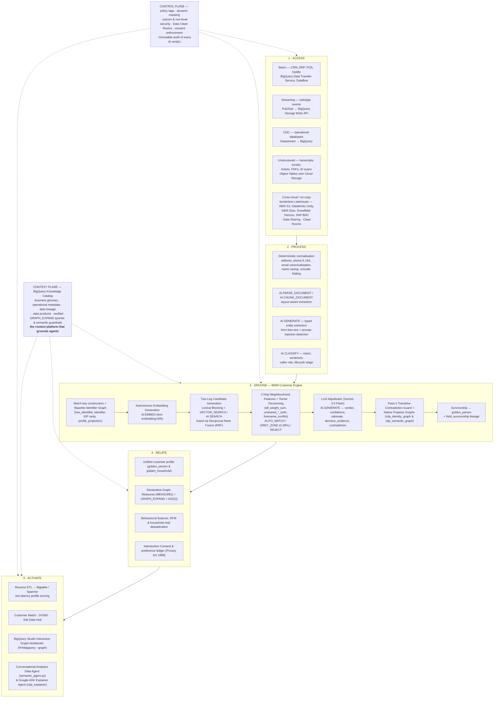
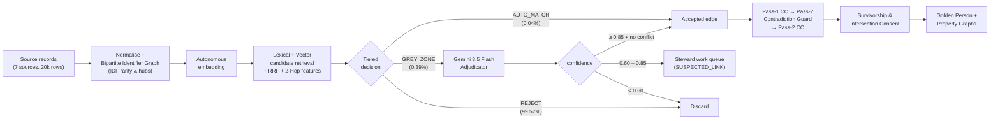

# Composable CDP on Google Cloud — Architecture Specification

**Version:** 2.0 · **Status:** Reference design & verified BigQuery implementation (`all-things-cdp.cdp`) · **Owner:** mattturner

The keystone of this design is **Master Data Management (Customer)** implemented 100% natively in BigQuery — combining **Bipartite Identifier Graph Rarity & 2-Hop Neighbourhood Features**, **Hybrid Search (`AI.SEARCH` / `VECTOR_SEARCH` + RRF)**, **Gemini 3.5 Flash Adjudication (`AI.GENERATE`)**, **Pass-2 Transitive Contradiction Pruning**, and **Declarative Semantic Property Graphs (`CREATE OR REPLACE PROPERTY GRAPH` + `GRAPH_EXPAND`)**. Layers 1, 2, 4 and 5 are conventional; **Layer 3 (Ground) is where the differentiation lives** and is specified in the most depth.

> [!NOTE]
> **Product naming.** This document uses the current Data Cloud names: **Lakehouse**, **Lakehouse runtime catalog**, **BigQuery Knowledge Catalog**, **Managed Service for Apache Spark**, **Managed Service for Apache Airflow**, and **borderless Lakehouse**.
>
> **Cross-cloud Lakehouse.** Borderless Lakehouse federates remote Iceberg catalogs and caches data blocks inside Google Cloud instead of provisioning compute in the remote cloud.

---

## 1. Design principles

| # | Principle | Consequence |
| :-- | :--- | :--- |
| P1 | **The warehouse is the CDP** | No customer data is replicated into a vendor SaaS to be resolved. One system of record, one security perimeter. |
| P2 | **Zero-copy wherever possible** | Object Tables for unstructured, borderless Lakehouse for other clouds and SaaS, Data Sharing and Clean Rooms for partner data. |
| P3 | **Every identity decision is auditable** | Merge decisions are immutable rows carrying model version, prompt version, confidence and a human-readable rationale. |
| P4 | **AI is used surgically, not universally** | 2-hop SQL graph features + hybrid retrieval settle **99.61%** of candidate pairs deterministically (`AUTO_MATCH` + `REJECT`). Only the **`0.39%` Grey Zone** calls Gemini 3.5 Flash. |
| P5 | **Non-destructive by default** | Source records are never overwritten. The golden record is a materialised *view of a decision*, and unmerge is a first-class operation. |
| P6 | **Under-merge over over-merge** | Wrongly linking two people is a privacy incident. Thresholds and the Pass-2 Contradiction Guard bias conservative (`99.16%` pairwise precision with every grey-zone pair judged; only 2 of the 15 planted hard-case types pass outright, and 4 false merges remain — 2 in `UNSTRUCTURED_ONLY`, 2 on `SINGLETON` controls — so the rest lose mostly recall, not precision). |
| P7 | **Consent never travels across a merge** | Consent is bound to the source record and re-evaluated at profile level via the Intersection Rule (Australian Privacy Act 1988). |
| P8 | **Closed-form SQL 2-hop graph features over black-box GNN pipelines** | Bipartite identifier IDF rarity (`LN(N / degree)`) and 2-hop neighbourhood divergence (`unshared_email_both`, `unshared_phone_both`) compute the exact sufficient statistics of a 2-layer GraphSAGE link predictor in pure SQL with zero GPU training or embedding staleness. |

---

## 2. Layered architecture


```mermaid
flowchart TD
    subgraph L1["1 · ACCESS"]
        A1["Batch — CRM, ERP, POS, loyalty<br/>BigQuery Data Transfer Service, Dataflow"]
        A2["Streaming — web/app events<br/>Pub/Sub → BigQuery Storage Write API"]
        A3["CDC — operational databases<br/>Datastream → BigQuery"]
        A4["Unstructured — transcripts, emails,<br/>tickets, PDFs, ID scans<br/>Object Tables over Cloud Storage"]
        A5["Cross-cloud / no-copy<br/>borderless Lakehouse — AWS S3, Databricks Unity,<br/>AWS Glue, Snowflake Horizon, SAP BDC<br/>· Data Sharing · Clean Rooms"]
    end

    subgraph L2["2 · PROCESS"]
        B1["Deterministic normalisation<br/>address, phone E.164, email canonicalisation,<br/>name casing, unicode folding"]
        B2["AI.PARSE_DOCUMENT / AI.CHUNK_DOCUMENT<br/>layout-aware extraction"]
        B3["AI.GENERATE — typed entity extraction<br/>from free text + prompt-injection detection"]
        B4["AI.CLASSIFY — intent, sentiment,<br/>caller role, lifecycle stage"]
    end

    subgraph L3["3 · GROUND — MDM Customer Engine"]
        C1["Match key construction + Bipartite Identifier Graph<br/>(has_identifier, identifier IDF rarity, profile_projection)"]
        C2["Autonomous Embedding Generation<br/>AI.EMBED (text-embedding-005)"]
        C3["Two-Leg Candidate Generation<br/>Lexical Blocking + VECTOR_SEARCH / AI.SEARCH<br/>fused via Reciprocal Rank Fusion (RRF)"]
        C4["2-Hop Neighbourhood Features + Tiered Decisioning<br/>(idf_weight_sum, unshared_*_both, forename_conflict)<br/>AUTO_MATCH / GREY_ZONE (0.39%) / REJECT"]
        C5["LLM Adjudicator (Gemini 3.5 Flash)<br/>AI.GENERATE → verdict, confidence,<br/>rationale, decisive_evidence, contradiction"]
        C6["Pass-2 Transitive Contradiction Guard +<br/>Native Property Graphs (cdp_identity_graph & cdp_semantic_graph)"]
        C7["Survivorship → golden_person<br/>+ field_survivorship lineage"]
        C1 --> C2 --> C3 --> C4 --> C5 --> C6 --> C7
    end

    subgraph L4["4 · RELATE"]
        D1["Unified customer profile (golden_person & golden_household)"]
        D2["Declarative Graph Measures (MEASURE() + GRAPH_EXPAND + AGG())"]
        D3["Behavioural features, RFM & household mail deduplication"]
        D4["Intersection Consent & preference ledger (Privacy Act 1988)"]
    end

    subgraph L5["5 · ACTIVATE"]
        E1["Reverse ETL → Bigtable / Spanner<br/>low-latency profile serving"]
        E2["Customer Match · DV360 · Ads Data Hub"]
        E3["BigQuery Studio Interactive Graph Notebooks (%%bigquery --graph)"]
        E4["Conversational Analytics Data Agent (semantic_agent.py)<br/>& Google ADK Explainer Agent (cdp_explainer)"]
    end

    CTX["CONTEXT PLANE — BigQuery Knowledge Catalog<br/>business glossary · operational metadata · data lineage<br/>· data products · verified GRAPH_EXPAND queries & semantic guardrails<br/><b>the context platform that grounds agents</b>"]

    CTRL["CONTROL PLANE — policy tags · dynamic masking<br/>· column & row-level security · Data Clean Rooms · consent enforcement<br/>· immutable audit of every AI verdict"]

    L1 --> L2 --> L3 --> L4 --> L5
    CTX -.-> L3
    CTX -.-> L4
    CTX -.-> L5
    CTRL -.-> L1
    CTRL -.-> L3
    CTRL -.-> L5
```

---

## 3. Layer 3 — the MDM engine in detail

### 3.1 Pipeline stages


```mermaid
flowchart LR
    S1["Source records<br/>(7 sources, 20k rows)"] --> S2["Normalise +<br/>Bipartite Identifier Graph<br/>(IDF rarity & hubs)"]
    S2 --> S3["Autonomous<br/>embedding"]
    S3 --> S4["Lexical + Vector<br/>candidate retrieval<br/>+ RRF + 2-Hop features"]
    S4 --> S5{"Tiered<br/>decision"}
    S5 -->|"AUTO_MATCH<br/>(0.04%)"| S6["Accepted edge"]
    S5 -->|"GREY_ZONE<br/>(0.39%)"| S7["Gemini 3.5 Flash<br/>Adjudicator"]
    S5 -->|"REJECT<br/>(99.57%)"| S8["Discard"]
    S7 --> S9{"confidence"}
    S9 -->|"≥ 0.85 + no conflict"| S6
    S9 -->|"0.60 – 0.85"| S10["Steward work queue<br/>(SUSPECTED_LINK)"]
    S9 -->|"< 0.60"| S8
    S6 --> S11["Pass-1 CC → Pass-2<br/>Contradiction Guard<br/>→ Pass-2 CC"]
    S11 --> S12["Survivorship &<br/>Intersection Consent"]
    S12 --> S13["Golden Person +<br/>Property Graphs"]
```

### 3.2 Match key construction

The match key is a single canonical string per record, ordered strongest-signal-first so that both the embedding and the BM25 leg weight identifiers appropriately.

```
{given_name} {middle_initial} {family_name} | {normalised_address} | {postcode} |
{canonical_email} | {e164_phone} | {account_number} | {dob_iso}
```

Normalisation rules applied before key construction:

| Field | Rule |
| :--- | :--- |
| Name | Unicode NFKD fold, strip punctuation, title case, retain original in a separate column |
| Address | Locale-aware standardisation (thoroughfare abbreviations, unit designators); postcode isolated into its own token |
| Postcode | Uppercase, single internal space, validated against locale pattern |
| Email | Lowercase; strip `+tag`; provider-specific dot-folding **only** for providers where it is semantically correct |
| Phone | E.164 with inferred region |
| DOB | ISO-8601; nulled if outside a plausible range |

> [!WARNING]
> Do not over-normalise. Aggressive email dot-folding and nickname substitution destroy signal the adjudicator needs. Normalise deterministic representation, not human variation — the vector leg exists to handle the latter.

### 3.3 Autonomous embeddings

```sql
match_embedding STRUCT<result ARRAY<FLOAT64>, status STRING>
  GENERATED ALWAYS AS (
    AI.EMBED(match_key,
             connection_id => 'cdp-conn',
             endpoint      => 'text-embedding-005')
  ) STORED OPTIONS (asynchronous = TRUE)
```

Properties that matter operationally:
- **Self-maintaining** — a change to `match_key` regenerates the vector. Source and index cannot diverge.
- **No orchestration** — no DAG, no retry logic, no dead-letter queue.
- **No separate vector store** — nothing additional to license, secure, or bring into scope for audit.
- **Multimodal capable** — image embeddings over `ObjectRef` columns are GA, which brings scanned ID documents into the same retrieval path.

Monitor the `status` field; treat a non-empty error status as a data-quality alert, not a silent skip.

### 3.4 Candidate generation — hybrid retrieval

**Design rationale.** Pure vector search resolves human variation (`Jon Smyth` ≈ `Jonathan Smith`) but ranks alphanumeric identifiers poorly, because strings like `2042`, `ACC-88231` or a tax file number carry little semantic content. Those identifiers are simultaneously the *strongest available evidence*. Lexical BM25 handles them exactly. Reciprocal Rank Fusion reconciles the two rankings.

For customer data this makes hybrid the correct default rather than an optimisation.

```sql
SELECT base.record_id, base.match_key, distance
FROM AI.SEARCH(
  TABLE cdp.party_records,
  'match_key',
  @probe_match_key,
  mode => 'HYBRID'
);
```

Extend the vector index with the lexical columns so the keyword leg is indexed rather than scanned.

> [!IMPORTANT]
> **Hybrid Search is Public Preview.** GA-only fallback: run `AI.SEARCH` (GA) for the semantic leg and a `SEARCH()` lexical pre-filter separately, then fuse the two rankings with RRF in SQL. More code, equivalent result, fully supported.

**Blocking.** Even with efficient retrieval, do not run all-pairs. Restrict candidate generation with cheap deterministic blocks — postcode district, name-metaphone + birth year, email domain + surname — and union the candidate sets. Blocking controls cost; hybrid retrieval controls recall within each block.

### 3.5 Bipartite Identifier Graph Rarity, 2-Hop Features & Tiered Decisioning

Before scoring pairs, Stage 40 (`40_block.sql` §40e–40h) builds a **Bipartite Profile $\leftrightarrow$ Identifier Graph** (`has_identifier`, `has_identifier_history`, `identifier`, `profile_projection`) and computes each identifier's **Inverse Document Frequency (`idf_weight = LN(N / degree)`)** and promiscuity flag (`is_promiscuous = degree > 25`).

Stage 50 (`50_candidates.sql`) enriches each candidate pair with:
1. **1-Hop Shared Identifier Rarity:** `idf_weight_sum`, `min_shared_degree`, `via_hub`, `hub_only`.
2. **2-Hop Neighbourhood Divergence (Replacing PyTorch GraphSAGE):** `unshared_email_both`, `unshared_phone_both`, `unshared_acct_both`, `street_match`, `street_conflict` — checking whether Record A and Record B carry *different* non-overlapping identifiers in their 2-hop neighbourhood.

| Tier | Condition | Action | Measured Volume (`20,000` records) |
| :--- | :--- | :--- | :--- |
| **`AUTO_MATCH`** | Two independent rare identifiers agree (`min_shared_degree <= 3`) or `combined_score >= 0.92` with zero 2-hop conflicts | Emit edge, no LLM | **`4,345` pairs (`0.04%`)** |
| **`GREY_ZONE`** | Single shared identifier, household collision, 2-hop divergence, or `0.72 <= combined_score < 0.92` | Gemini 3.5 Flash adjudication | **`41,769` pairs (`0.39%`)** |
| **`REJECT`** | Promiscuous hub collision (`hub_only`), DOB conflict, or `combined_score < 0.72` | Discard | **`10,727,728` pairs (`99.57%`)** |

Use `optimization_mode => 'MINIMIZE_COST'` on any high-volume `AI.IF` / `AI.CLASSIFY` pre-filter; distilled proxy models reduce cost substantially at the pre-filter stage where a false negative is recoverable downstream.

### 3.6 The LLM Adjudicator

```sql
AI.GENERATE(
  prompt => <structured comparison prompt with 1-hop rarity & 2-hop divergence>,
  connection_id => 'cdp-conn',
  endpoint => 'gemini-3.5-flash',
  output_schema =>
    'verdict STRING, confidence FLOAT64, decisive_evidence STRING, '
    || 'contradiction STRING, rationale STRING, injection_detected BOOL'
)
```

**Cases it resolves that rules cannot:**
- Diminutives and phonetic variants (`Bob`/`Robert`, `Smyth`/`Smith`, `Xiu Ying` / `Xiuying`)
- Married-name and legal-name changes (`SURNAME_CHANGE`)
- Transliteration across scripts (`TRANSLITERATION`, `DIACRITIC_VARIANT`)
- **Households** — four people, one address or shared family email (`EM:thegills@gmail.com`), different first names → *different people* (`0` FPs)
- Sole traders who are simultaneously a person and a business entity (`SOLE_TRADER`)
- Unstructured call transcripts and support tickets (`UNSTRUCTURED_ONLY`, `CALL_ON_BEHALF`)

**What makes it defensible:**

| Output field | Purpose |
| :--- | :--- |
| `verdict` | `MATCH`, `NO_MATCH`, or `UNCERTAIN` |
| `confidence` | Routes to auto-accept (`>= 0.85`), steward queue (`0.60 - 0.85`), or reject |
| `rationale` | Human-readable justification — the regulatory answer |
| `decisive_evidence` | Machine-readable evidence summary enabling aggregate audit of *why* merges happen |
| `contradiction` | Explicit account of any conflicting attribute (e.g., divergent forenames or addresses) |
| `injection_detected` | Hard safety veto against adversarial prompt-injection payloads in free text |

**Determinism controls.** Pin the model version. Version prompts in source control. Store the full verdict row immutably in `cdp.adjudications`. Never mutate a historical verdict — supersede it with a new one (`v_adjudications_current`).

### 3.7 Two-Pass Contradiction Guard & Dual Native Property Graphs (`70_graph.sql`)

Stage 70 runs **Two-Pass Connected Components** followed by two native BigQuery `PROPERTY GRAPH` declarations:

1. **Pass-1 Connected Components $\rightarrow$ Pass-2 Contradiction Guard:** If `Madeleine Davenport` links to `M Davenport` (via shared household phone) and `Mia Davenport` also links to `M Davenport`, Pass 1 puts both sisters in the same component. Pass 2 (`component_contradictions`) detects incompatible full forenames or DOBs inside the component and severs the ambiguous initial-bridge edges (`suppressed_by_contradiction = TRUE`) before computing final `person_assignment`.
2. **Operational & Visual Property Graph (`cdp.cdp_identity_graph`):**
   ```sql
   -- Abridged: 9 node tables and 13 edge tables in full -- see demo/sql/70_graph.sql
   CREATE OR REPLACE PROPERTY GRAPH cdp.cdp_identity_graph
   NODE TABLES (
     cdp.node_source_record AS SourceRecord KEY (record_id),
     cdp.identifier         AS Identifier KEY (identifier_id),
     cdp.node_person        AS Person KEY (person_id),
     cdp.node_household     AS Household KEY (household_id),
     cdp.node_address       AS Address KEY (address_id),
     cdp.node_email         AS Email KEY (email_id),
     cdp.node_phone         AS Phone KEY (phone_id),
     cdp.node_account       AS LoyaltyAccount KEY (account_id)
   )
   EDGE TABLES (
     cdp.has_identifier     AS HAS_IDENTIFIER SOURCE KEY (record_id) REFERENCES SourceRecord DESTINATION KEY (identifier_id) REFERENCES Identifier,
     cdp.edge_resolves_to   AS RESOLVES_TO    SOURCE KEY (record_id) REFERENCES SourceRecord DESTINATION KEY (person_id) REFERENCES Person,
     cdp.edge_member_of     AS MEMBER_OF      SOURCE KEY (person_id) REFERENCES Person       DESTINATION KEY (household_id) REFERENCES Household,
     cdp.edge_suspected_link AS SUSPECTED_LINK SOURCE KEY (person_id_a) REFERENCES Person    DESTINATION KEY (person_id_b) REFERENCES Person,
     cdp.edge_related_to    AS RELATED_TO     SOURCE KEY (person_id) REFERENCES Person       DESTINATION KEY (related_person_id) REFERENCES Person
     -- plus LIVES_AT, HAS_EMAIL, HAS_PHONE, HOLDS_ACCOUNT
   );
   ```
3. **Declarative Semantic Property Graph (`cdp.cdp_semantic_graph`):** Declares node-scoped `MEASURE()` expressions on `Profile`, `Membership`, and `Identifier` so `FROM GRAPH_EXPAND("cdp.cdp_semantic_graph")` + `AGG()` computes multi-hop brand/identifier metrics without join fan-out.

### 3.8 Survivorship & 3-Method Benchmark (`all-things-cdp.cdp`)

Attribute-level rules in `80_survivorship.sql` produce `cdp.golden_person` and `cdp.field_survivorship`. Stage 95 (`95_scorecard.sql`) benchmarks **three resolution methods** side by side against hidden ground truth (`20,000` records, `8,000` true people):

| Method | Pairwise TP | Pairwise FP | Precision | Recall | F1 | Largest Component | Hairballs (`>30` profiles) |
| :--- | ---: | ---: | ---: | ---: | ---: | ---: | ---: |
| **`baseline_cc`** *(Naive Connected Components)* | `8,064` | `13,488,214` | `0.06%` | `42.95%` | `0.0012` | `5,195` | `1` (`5,195` profiles) |
| **`weighted_cc`** *(IDF Graph Rarity `weight >= 7.0`)* | `7,566` | `321` | `95.93%` | `40.30%` | `0.5675` | `5` | `0` |
| **`composable_cdp`** *(2-Hop Graph + Hybrid Search + LLM + Pass-2 Guard)* | **`8,782`** | **`74`** | **`99.16%`** | **`46.77%`** | **`0.6356`** | **`9`** | **`0`** |

> [!CAUTION]
> Inheriting marketing consent across a merge creates a regulatory incident at scale. Consent is bound to the source record and the profile-level permission is the *intersection*, not the union (`85_consent.sql`).

---

## 4. Data model (core tables & graphs)

| Object | Grain | Purpose |
| :--- | :--- | :--- |
| `cdp.party_records` / `cdp.party_search` | One row per source record | Normalised records, `match_key`, autonomous embedding (`party_vectors`) |
| `cdp.identifier` / `cdp.has_identifier_history` | One row per identifier / link | Bipartite Identifier Graph with `degree`, `idf_weight`, `is_promiscuous`, and temporal `is_current` |
| `cdp.profile_projection` | One row per shared-ID pair | 2-hop identifier graph projection (`weight`, `min_shared_degree`, `via_hub`, `hub_only`) |
| `cdp.pair_features` / `cdp.pair_tiers` | One row per candidate pair | Hybrid RRF + 1-hop/2-hop features (`unshared_*_both`, `forename_conflict`) + tiering |
| `cdp.adjudications` / `cdp.pair_decisions` | One row per judged pair | Append-only Gemini 3.5 Flash verdicts with rationale, contradiction, and injection guard |
| `cdp.resolution_edges` / `cdp.person_assignment` | One row per edge / record | Pass-2 contradiction-pruned edges and stable `person_crosswalk` assignment |
| `cdp.resolution_runs` / `cdp.v_method_comparison` | One row per method / pathology | 3-method benchmark (`baseline_cc`, `weighted_cc`, `composable_cdp`) |
| `cdp.golden_person` / `cdp.field_survivorship` | One row per person / field | Mastered customer profile and contested-field provenance |
| `cdp.consent_state` / `cdp.v_consent_impact` | One row per `(person, channel, purpose)` | Intersection consent ledger & Privacy Act 1988 audit |
| `cdp.cdp_identity_graph` / `cdp.cdp_semantic_graph` | Native BigQuery Property Graphs | ISO GQL (`GRAPH_TABLE` / `%%bigquery --graph`) and `GRAPH_EXPAND` + `AGG()` semantic layer |

---

## 5. Context plane — Knowledge Catalog

Knowledge Catalog is **the context platform for agents**, not a passive metadata registry. It harvests operational and business metadata and serves it as grounding context so that agents — and humans — operate on agreed meaning rather than guesses.

This matters directly to the CDP because **the golden record and the catalog answer two different questions, and an agent needs both**:

| | Golden record (Layer 3) | Knowledge Catalog (context plane) |
| :--- | :--- | :--- |
| Answers | *Are these records the same person?* | *What does "active customer" mean, and where did this number come from?* |
| Artefact | `person_id`, merged attributes, merge rationale | Glossary terms, lineage, data products, verified queries |
| Failure if missing | Duplicate or conflated customers | Confident answers using the wrong definition |

### What the catalog contributes

| Capability | Role in this architecture |
| :--- | :--- |
| **Business glossary** | Canonical definitions of *active customer*, *household*, *churned*, *consented* — mapped to the physical columns in `cdp.golden_records`. Removes the single largest source of disagreement in customer reporting. |
| **Data lineage** | Traces any activated segment or reported figure back through the golden record, the identity edges and the source systems. Grounds agents *and* answers auditors — one substrate, two audiences. |
| **Operational metadata** | Freshness, quality scores and profiling on the party and golden-record tables, so an agent can tell whether a source is trustworthy right now. |
| **Data products** | Publishes the golden record as a governed, discoverable product with an owner and a contract, rather than a table someone found. |
| **Verified queries & semantic guardrails** | Pre-approved SQL patterns for common customer questions, which measurably reduces agent hallucination on complex retrieval. |

> [!IMPORTANT]
> Solving identity and then attaching an agent without a context plane produces a system that is *confidently* wrong. Resolution fixes *who*; the catalog fixes *what the words mean*. Ship both or the agentic activation story does not hold.

---

## 6. Control plane — governance & enforcement

| Control | Mechanism |
| :--- | :--- |
| PII protection | Policy tags with dynamic data masking, enforced in-engine |
| Access segmentation | Row-level security for regional and consent-based restriction |
| Partner matching | Data Clean Rooms — no raw record exchange |
| AI decision audit | Immutable `match_verdicts` with model version, prompt version, rationale |
| Right to explanation | `rationale` and `deciding_evidence` retrievable per data subject, traceable via catalog lineage |
| Retention | Partition expiry aligned to retention policy; verdicts retained for the audit window |

---

## 7. Known risks

| Risk | Severity | Mitigation |
| :--- | :--- | :--- |
| Hybrid Search is Public Preview | Medium | Documented GA-only fallback in §3.4 |
| Borderless Lakehouse cross-cloud data access is Preview | Medium | If a source must be cross-cloud and GA today, replicate that source into BigQuery for now and treat borderless Lakehouse as the target state. Does not affect the MDM engine itself. |
| LLM non-determinism in merge decisions | High | Pinned model, versioned prompts, immutable verdicts, golden-set regression suite |
| Over-merge (two people joined) | **High** | Conservative thresholds, giant-cluster detection, first-class unmerge |
| Cost at scale | Medium | Blocking + three-tier funnel + `MINIMIZE_COST` pre-filter; modelled explicitly in the pilot |
| Consent contamination across merges | **High** | Consent never inherited; profile permission is the intersection |
| No steward UI out of the box | Medium | Scope a lightweight console over `cdp.steward_queue`; be explicit about where dedicated MDM products still add value |
| Prompt injection via unstructured sources | Medium | Treat extracted text as untrusted; delimit and escape in prompts; never let source text alter adjudication instructions |

---

## 8. Open design decisions

1. **Embedding model** — `text-embedding-005` vs. natively-hosted Gemma embeddings. Trade-off between quality and per-row cost at full-corpus scale.
2. **Real-time vs. batch resolution** — the 133x single-query efficiency gain makes inbound-event resolution viable, but it needs a defined SLA before it is designed in.
3. **Steward tooling** — build a minimal console, or integrate with an existing data-quality tool.

### Resolved

4. **Cluster stability** — ~~whether `person_id` must be stable across reprocessing runs~~. **Settled: it must be, and it is implemented.** A persistent `person_crosswalk` table holds the `record_id → person_id` assignment across runs. On each run a cluster inherits the `person_id` held by the plurality of its members; only a genuinely new cluster mints one. Recomputation from scratch is never allowed to renumber an existing population. See `demo/sql/70_graph.sql` §70e, demonstrated by `demo/scenarios/scenario_A.sql`.
