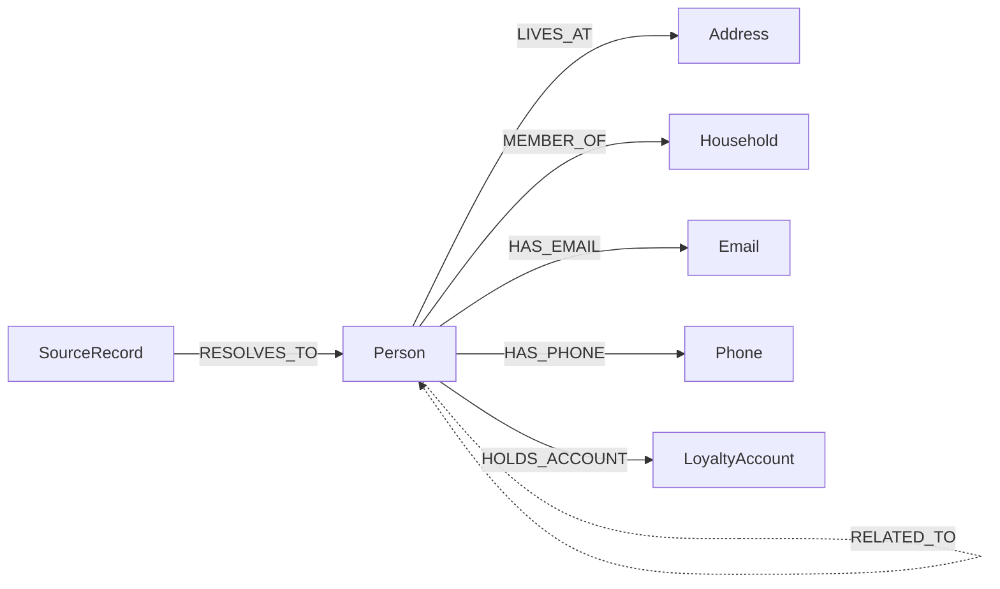

# Composable CDP — BigQuery demo

An end-to-end customer MDM build that runs entirely inside BigQuery: eight messy
sources in, one mastered customer graph out, with a scorecard that says honestly how
well it did.

Everything is synthetic. No real people, and no GCP project, bucket or region is
committed anywhere in this repository — `setup.sh` asks.

---

## What it actually demonstrates

| # | Claim | Where to look |
| :-- | :--- | :--- |
| 1 | Unstructured sources need no ETL | `20_normalise.sql` — `AI.GENERATE` reads call transcripts from an object table and ticket bodies from Parquet, in place |
| 2 | Embeddings maintain themselves | `30_embed.sql` — `GENERATED ALWAYS AS (AI.EMBED(...))`. There is no embedding job to run or repair |
| 3 | Neither search leg is sufficient alone | `v_retrieval_recall` — what a semantic-only and a lexical-only architecture would each have missed, against truth |
| 4 | An LLM is affordable if it only sees the hard cases | `v_scorecard.pct_of_pairs_using_an_llm` |
| 5 | Transitive closure must be distrusted | `70_graph.sql` — contradicted clusters are rebuilt, not published |
| 6 | Identifiers must outlive the clusters that made them | `person_crosswalk`, Scenario A |
| 7 | Merging people is not merging permissions | `85_consent.sql`, Scenario C |
| 8 | The graph is the point, not the byproduct | `90_downstream.sql` — segmentation, households, shared-identifier risk, agent grounding, activation |

---

## Running it

```bash
cd demo
./setup.sh          # asks for project, region, bucket, connection, thresholds
./run.sh            # generate → upload → 00 … 95
```

`setup.sh` writes `config.env`, which is git-ignored and `chmod 600`. Nothing in the
committed tree contains your environment.

`run.sh` is idempotent. Resume or repeat any part of it:

```bash
./run.sh --from 50      # resume from candidate generation
./run.sh --only 95      # re-score without re-running anything
./run.sh --dry-run      # render every SQL file, submit nothing
```

Then read the two things that matter:

```sql
SELECT * FROM `PROJECT.DATASET.v_scorecard`;
SELECT * FROM `PROJECT.DATASET.v_case_results` ORDER BY passed, case_type;
```

And the five scenarios:

```bash
./scenarios/run_scenario.sh A   # do identifiers survive a re-run?
./scenarios/run_scenario.sh B   # what does each search leg find alone?
./scenarios/run_scenario.sh C   # what does the consent rule cost?
./scenarios/run_scenario.sh D   # did the contradiction guard hold?
./scenarios/run_scenario.sh E   # can one inbound record resolve in a single query? (appendix)
```

---

## Before you present it

> [!IMPORTANT]
> Run the whole thing end to end, at least once, well before the meeting — and read
> `v_case_results` before you decide which slides to show.

Two reasons. First, several features used here are recent, and regional availability
varies; a missing capability is much easier to work around two days out than two
minutes out. Second, and more importantly: **some hard cases will fail**. That is by
design. The failures are the most credible part of the demo, but only if you have
read them and can talk about them. Walking into a room of practitioners with an
unexamined scorecard is worse than not showing one.

---

## Pipeline

| Stage | File | What it does |
| :-- | :--- | :--- |
| 00 | `sql/00_setup.sql` | Datasets and normalisation UDFs (Australian locale) |
| 05 | `sql/05_preflight.sql` | Probes every model and the Vertex connection before any data is touched |
| 10 | `sql/10_land_sources.sql` | 4 managed, 3 external, 1 object table, 2 truth tables |
| 20 | `sql/20_normalise.sql` | AI extraction from unstructured text; one unified `party_records` |
| 30 | `sql/30_embed.sql` | Self-maintaining embeddings, hybrid index, BM25 index |
| 40 | `sql/40_block.sql` | Deterministic blocking, with an honest account of what it dropped |
| 50 | `sql/50_candidates.sql` | Semantic retrieval, RRF, pair features, three-way tiering |
| 60 | `sql/60_adjudicate.sql` | LLM on the grey zone only; append-only verdict ledger |
| 70 | `sql/70_graph.sql` | Connected components, contradiction guard, stable IDs, mastered graph |
| 80 | `sql/80_survivorship.sql` | Field-level survivorship with full provenance |
| 85 | `sql/85_consent.sql` | Intersection rule, suppressions, audience impact |
| 90 | `sql/90_downstream.sql` | Segmentation, households, graph risk, agent grounding, activation |
| 95 | `sql/95_scorecard.sql` | Ground-truth scoring and per-case results |
| 96 | `sql/96_cost_model.sql` | Measured cost of the run, extrapolated to target volume |

Ground truth lands in a **separate dataset** (`<prefix>_truth`). Only stage 95 reads
it. Any other stage joining to it is a bug, and keeping it in its own dataset is what
makes such a bug visible in review rather than silently flattering the score.

---

## The mastered graph

Seven node types, eight edge types.



Emails, phones, addresses and accounts are nodes rather than attributes on purpose.
It is what makes "who else uses this phone number" a one-hop question instead of a
self-join nobody writes.

The two dashed edges are the interesting ones. `SUSPECTED_LINK` is the steward queue
expressed in the graph, so a consumer can see that a profile is provisional.
`RELATED_TO` is how *"I'm calling about my wife's account"* is recorded — as a
relationship, which is correct, rather than as a merge, which is easy and wrong.

---

## Configuration worth understanding

Set by `setup.sh`, stored in `config.env`.

| Variable | Default | Why you might change it |
| :--- | :--- | :--- |
| `CDP_TAU_HI` | `0.92` | Auto-match threshold. Lower it and precision falls faster than recall rises |
| `CDP_TAU_LO` | `0.72` | Below this, a pair with no strong identifier and no semantic signal is dropped |
| `CDP_ACCEPT_CONFIDENCE` | `0.85` | How sure the adjudicator must be before its MATCH becomes a link |
| `CDP_STEWARD_CONFIDENCE` | `0.60` | Below this, a MATCH is discarded rather than queued |
| `CDP_GREYZONE_CAP` | `50000` | Hard ceiling on LLM calls, highest-scoring pairs first |
| `CDP_TOPK` | `25` | Semantic neighbours per record. Raising it raises recall and cost together |
| `CDP_RECORDS` | `200000` | **Do not go below ~6,000** — vector index creation needs 5,000 rows |
| `CDP_PEOPLE` | `80000` | Distinct people behind those records. Fewer people means more duplicates per person |

Two things about the thresholds are worth knowing before you tune them.

**Tiering is rail-driven, not threshold-driven.** The thresholds only decide borderline
cases. Ordered rules decide the rest: a date-of-birth conflict is disqualifying at any
score; two agreeing strong identifiers auto-match regardless of textual similarity; a
mutual top-ranked semantic neighbour reaches the adjudicator even with a low score. A
single blended threshold cannot express any of that, and tuning weights until it
approximately does produces a number nobody can defend in a review. The rails and the
reasoning behind each are at the top of `50_candidates.sql` §50d.

**Semantic similarity can raise a score and never lower one.** Averaging a mediocre
cosine into a near-certain match would sink exactly the cases the embedding exists to
catch — a married name plus a house move shares a date of birth and a mobile number
but very little text. Absence of semantic similarity is not evidence against.

The weights themselves are priors, not findings. `v_scorecard` measures what they
actually produce, and that measurement is the result.

If `CDP_GREYZONE_CAP` is being hit, read `v_candidate_funnel` before raising it — a
large grey zone usually means the rails are admitting something they should not.

---

## Known limitations

Stated here rather than discovered on stage.

- **`SOUNDEX` is Anglocentric.** It will under-perform on non-Anglo surnames. It is
  used only as a *blocking* key, never as a decision, and the semantic leg is the
  safety net. The `TRANSLITERATION` row in `v_case_results` is where that claim is
  tested.
- **Phone normalisation is digit-stripping, single-country.** A production build needs
  a real library behind a remote function.
- **Embeddings are generated synchronously.** Production should use
  `asynchronous = TRUE`; this pipeline runs stages in sequence and BigQuery SQL has no
  way to sleep while waiting for a background job. The tradeoff is documented in
  `30_embed.sql`.
- **Households are inferred from a shared current address.** Deliberately not from a
  shared surname, which would miss unmarried partners and lodgers and would wrongly
  group strangers in a block of flats. A household is an inference, and must never be
  used as evidence that two people are one person.
- **The corpus is Australian-flavoured and synthetic.** Names, addresses,
  suburbs, state-coded four-digit postcodes, `+61` phone numbers and AUD amounts
  are all localised. Real name and address distributions are far heavier in the
  tail, and real data contains failure modes no generator invents.
- **5,051 of the 80,000 people share an exact full name with someone else.**
  That is roughly what the birthday problem predicts for a real file this size,
  so the *rate* is realistic — but it is driven by finite name banks rather than
  true population frequencies, so the collision *pattern* is not. Of those, only
  one pair is genuinely ambiguous (same city, birthdays within two years); the
  rest are separable on address or age, which is a fair test rather than an
  unanswerable one.
- **119 of the 400 planted `HOUSEHOLD` people carry no date of birth on any
  record**, against 26.7% of the corpus as a whole. They remain separable by
  forename, but any rule that depends on a date-of-birth conflict will not split
  them. If `HOUSEHOLD` fails, check this first — the corpus is as likely to be
  the cause as the pipeline.
- **Synthetic names can still coincide with real people's.** The name banks are
  built from real Australian name-frequency data, so the roughly two million
  combinations they can produce necessarily include names that real and notable
  Australians have — and, because the Anglo pools draw on naming stock the three
  countries share, names that notable Britons and Americans have too. The
  highest-recognition combinations are blocked outright — a hundred-odd of them,
  `TODO(count)` pending the rebuilt roster — but that list is not coverage and
  cannot be; see `generate/README.md`. Any resemblance to a real person is
  coincidental.
- **Blocking drops oversized blocks.** Pairs that only ever co-occurred in a dropped
  block are recovered by the semantic leg, if at all. `v_blocking_funnel` reports the
  count rather than hiding it.
- **The Parquet file is only byte-reproducible on a pinned `pyarrow`.** The writer
  version is embedded in the file. `generate/requirements.txt` pins the range;
  determinism of the *data* is unaffected.

---

## Cost

Stage 96 measures this rather than estimating it. It reads the token counts the
models themselves reported (`usageMetadata` on every `AI.GENERATE` call) and the
bytes and slot-time BigQuery actually billed, then multiplies by unit prices held
in `config.env`.

```sql
SELECT * FROM `PROJECT.DATASET.v_cost_model`;       -- model spend, and at target volume
SELECT * FROM `PROJECT.DATASET.v_cost_compute`;     -- BigQuery compute, both pricing models
SELECT * FROM `PROJECT.DATASET.v_cost_sensitivity`; -- what the grey-zone rate is worth
SELECT * FROM `PROJECT.DATASET.cost_components`;    -- per component, with a MEASURED/ESTIMATED flag
```

Three things to be honest about when showing these:

> [!WARNING]
> **The unit prices are list prices captured on 14 Sep 2026 and they will go stale.**
> They live in `config.env` precisely so they can be corrected in one place. Re-verify
> against the Vertex AI and BigQuery pricing pages before putting a number in front of
> a customer.

> [!IMPORTANT]
> **Two of the five components are estimated, not measured.** `AI.EMBED` and
> `AI.CLASSIFY` return no usage metadata, so their token consumption is derived from
> input length at roughly 4 characters per token. That heuristic is calibrated for
> prose and is at its worst on exactly what the embedder sees — names, postcodes and
> account numbers. `cost_components.basis` marks which is which; do not present the
> estimated lines as though they were measured.

> [!NOTE]
> **The extrapolation to `CDP_TARGET_RECORDS` is linear, and adjudication is the
> component least likely to behave linearly.** How many pairs land in the grey zone
> depends on how well blocking discriminates, and blocking discriminates less well as
> the corpus densifies. Treat the target figure as a floor rather than a forecast, and
> use `v_cost_sensitivity` to show the range instead of a single number.

Shape of the spend: the embedding and extraction passes scale with the corpus; the
adjudicator is capped by `CDP_GREYZONE_CAP` and should be a small fraction of pairs.
If `v_scorecard.pct_of_pairs_using_an_llm` is not small, the thresholds need attention
before the budget does.

Re-running is cheap. `run.sh` skips generation if `data/` exists, and the adjudicator
skips any pair already judged by the same model and prompt version — so iterating on
later stages costs almost nothing.

**For a cheap first pass**, re-run `setup.sh` with `20000` records and `8000` people.
Same seed, same hard cases, roughly a tenth of the cost and runtime. Debug there, then
scale up once the pipeline is green.

See [TEARDOWN.md](TEARDOWN.md) when you are done.
